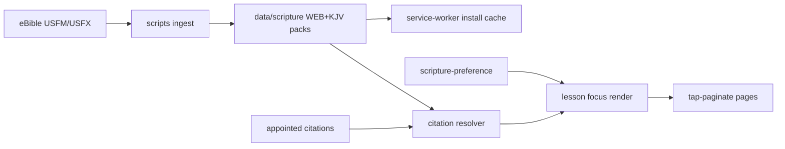
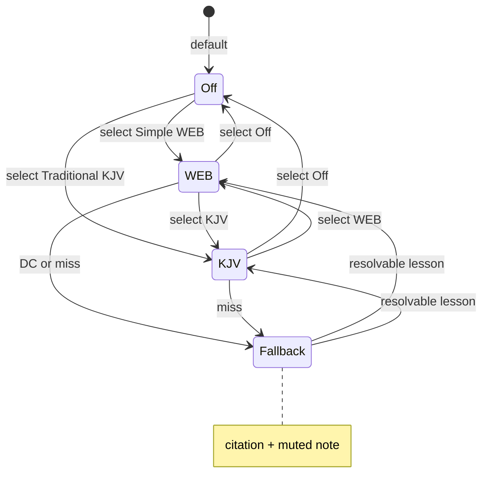

# feat: Scripture packs, preference, and reading spike

## Goal Capsule

- **Objective:** Ship public-domain WEB and KJV verse packs from eBible, a device Scripture setting (Off / Simple WEB / Traditional KJV), citation→verse resolution for appointed Daily Office lessons, always-offline packs, and a tap-to-paginate (no scroll) reading design spike.
- **Authority:** Confirmed scoping in this planning session; Product Contract below.
- **Stop when:** Both packs resolve Protestant-canon appointed lessons offline (WEB deuterocanonical gaps use R8 fallback); setting works independently of prayer format and offline state; Off keeps citations without body text; spike shows selectable pagination options on lesson focus; `scripts/check-site.mjs` covers the new paths; FAQ/llms/privacy/NOTICE no longer claim the app never reproduces Scripture.
- **Out of capsule:** Production polish of one locked reading layout; free full-Bible browsing; replacing BCP psalter text with WEB/KJV; Noonday/Compline short readings.

---

## Product Contract

### Summary

Readers keep seeing appointed lesson citations. With Scripture On, they also get offline WEB or KJV body text for those lessons, switched from Settings at any time. A short design spike presents tap-to-paginate reading options (no scrolling) so a layout can be chosen later.

### Problem Frame

The app currently points people to a physical Bible. Appointed citations already live in the reading pack and Traditional appointments, but there is no verse corpus, no citation parser for Bible lessons, and no preference. Product copy still says Scripture is not reproduced. Readers who want modern (WEB) or traditional (KJV) text need that content offline like the rest of the PWA.

### Key Decisions

- KD1. Scripture setting values are Off / Simple (WEB) / Traditional (KJV). `(session-settled: user-directed — chosen over other translations or labels.)` Governs R1, R2.
- KD2. Off keeps the lesson citation visible and withholds Bible body text. `(session-settled: user-directed — chosen over hiding the reading entirely.)` Governs R3.
- KD3. Both WEB and KJV packs always install with the PWA so the setting can change while offline. `(session-settled: user-directed — chosen over on-demand fetch.)` Governs R4, R12.
- KD4. Primary ingest is eBible machine downloads, not Kaggle or MetaV. `(session-settled: user-approved — chosen over Kaggle CSV / MetaV CC BY-SA mashup: thin provenance and ShareAlike risk.)` Governs R6.
- KD5. Reading UI in this pass is a tap-to-paginate design spike with no scrolling; layout is not locked until after the spike. `(session-settled: user-directed — chosen over deferring all reading UI.)` Governs R10, R11.
- KD6. Scripture preference is independent of prayer format (Simple vs Traditional Prayer). `(session-settled: user-approved — chosen over auto-linking to prayer format.)` Governs R1, R9.

### Actors

- A1. Reader using Simple Prayer or Traditional Prayer on the installed PWA or website.
- A2. Maintainer who regenerates packs, bumps version when PWA assets change, and promotes.

### Requirements

**Preference**

- R1. Settings exposes Scripture: Off, Simple (WEB), Traditional (KJV), independent of prayer format.
- R2. Default preference is Off.
- R3. Off shows appointed lesson citations and does not show WEB/KJV body text.
- R4. Changing preference works while offline once packs are installed.
- R5. Preference change remaps the current lesson focus pages without requiring a reload.

**Corpus and resolution**

- R6. Verse text comes from eBible `engwebp` (WEB Protestant Updated, LORD) and `eng-kjv` (KJV 1769 + Apocrypha), ingested into compact packs shipped with the app.
- R7. Appointed Morning/Evening lesson citations resolve to ordered verse text for the selected translation when available.
- R8. Unresolvable citations (including WEB + deuterocanonical books absent from `engwebp`) keep the citation and show a short muted note that the passage is not in this translation.
- R9. Preference applies to Morning/Evening appointed lessons on both Simple Prayer and Traditional Prayer surfaces.

**Reading spike**

- R10. Design spike presents at least two tap-to-paginate (no scroll) reading options for lesson body text.
- R11. Spike navigation uses tap/edge/page advance consistent with existing focus paging; vertical scrolling of lesson body is not offered.

**Offline and ship hygiene**

- R12. After a successful install/update that includes scripture packs, both translations are available offline.
- R13. FAQ, `llms.txt`, Privacy offline-files copy, and NOTICE/attribution are updated for eBible WEB/KJV and the new preference.
- R14. Shipping packs or scripture reader/worker changes bumps `APP_VERSION` and lockstep cache query params per existing promote rules.

### Key Flows

- F1. Prefer Off (default)
  - **Trigger:** First visit or Scripture Off.
  - **Steps:** Open OT/NT/GS or Traditional lesson focus → see citation only → advance focus as today.
  - **Covered by:** R2, R3
- F2. Prefer WEB or KJV offline
  - **Trigger:** Reader selects Simple (WEB) or Traditional (KJV) with packs installed, then opens a lesson.
  - **Steps:** Resolve citation → show tap-paginated body → can switch preference offline and remap focus pages without reload.
  - **Covered by:** R4, R5, R7, R10, R11, R12
- F3. WEB on a deuterocanonical lesson
  - **Trigger:** Scripture is WEB; appointed lesson is Wisdom / Ecclus. / Baruch / etc.
  - **Steps:** Citation stays; muted “not in this translation” note; no empty unexplained page.
  - **Covered by:** R8
- F4. Install / update
  - **Trigger:** Fresh install or versioned update.
  - **Steps:** Shell and both scripture packs land; airplane mode still serves selected translation for resolvable lessons.
  - **Covered by:** R12, R14

### Acceptance Examples

- AE1. Covers F1. With Off, Isaiah 1:1-9 focus shows the citation and no verse paragraphs.
- AE2. Covers F2. With WEB on and online then airplane mode, Matthew 25:1-13 paginates WEB text by tap with no body scroll.
- AE3. Covers F2. With KJV on offline, the same citation paginates KJV text.
- AE4. Covers F3. With WEB on during a Wisdom-appointed day, focus shows citation plus muted unavailable note, not a blank body.
- AE5. Covers R5 / R9. Mid-lesson switch Off→KJV remaps Traditional `*_LESSON_*` and Simple lesson focus to KJV pages (or citation-only when Off).
- AE6. Covers R10. Spike control or settings-adjacent switch shows ≥2 pagination options without enabling scroll.

### Success Criteria

- Appointed lesson citations from the reading pack resolve for standard Protestant canon books in both translations.
- Both packs work offline after install.
- `node scripts/check-site.mjs` asserts new HTML ids, smoke paths, Off default, and at least one resolved lesson sample per translation.
- Product copy no longer contradicts shipped Scripture text.

### Scope Boundaries

**In scope**

- eBible ingest → compact verse packs; citation resolver; preference; SW offline serve; Simple + Traditional Morning/Evening lesson bodies; tap-paginate design spike; gate + attribution/copy.

**Deferred for later**

- Locking one production reading layout after spike feedback.
- Optional-verse include/omit user control (default include — see Assumptions).
- Free browsing of books/chapters outside appointed lessons.
- Replacing BCP Traditional psalmody with WEB/KJV.
- Scripture preference for Noonday / Compline fixed short readings.

**Outside this product's identity**

- Copyrighted modern translations (NRSV, ESV, etc.).
- UK-only Crown printing workflow for KJV (PD redistribution outside UK remains fine for this US Pages PWA).

### Assumptions

- Optional parenthetical segments in citations are included in resolved text by default.
- `A or B` / rotating alternatives use each surface’s existing citation selection rule; only that citation is resolved.
- Spike ships the real Off/WEB/KJV control on both surfaces; visual options are the variable under test.
- Compact verse packs (not raw multi-MB HTML ZIPs) are what the SW installs, built from eBible USFM or USFX.

### Sources

- Confirmed scoping dialogue (preference, offline always-load, spike, eBible).
- eBible: `engwebp`, `eng-kjv` USFM/USFX ZIPs under `https://ebible.org/Scriptures/`.
- Rejected primary sources: Kaggle `kk99807` (thin provenance); MetaV theonize (CC BY-SA compilation).
- Repo patterns: `psalm-preference.js`, `reading-pack-loader.js`, `service-worker.js` SHELL, `bookmark-engine.js` lesson/focus + `paginateTimedOfficeByFit`, `daily-office.js` lesson sections, `scripts/check-site.mjs`.
- Institutional: `docs/solutions/conventions/promote-requires-live-hostname-check.md`, `CONCEPTS.md`.

---

## Planning Contract

### Key Technical Decisions

- KTD1. Editions: ingest `engwebp` + `eng-kjv` (with Apocrypha). `(session-settled: user-approved — eBible over Kaggle/MetaV.)` **Conflict call-out:** Protestant WEB omits ~60+ deuterocanonical appointed lessons in the reading pack; those lessons use R8 fallback when WEB is selected; KJV covers them via Apocrypha. Chosen over `engwebu` until product revisits Simple (WEB) coverage of DC books.
- KTD2. Build-time USFM/USFX → compact versioned JSONL (or equivalent) verse packs under `data/scripture/` (or sibling), with a deterministic `scripts/` ingest. Prefer USFX single-XML or USFM book files over eBible HTML. No runtime ZIP unpack in the browser.
- KTD3. New citation resolver module maps BCP-shaped strings (`--` spans, commas, `(optional)`, half-verses, `Ecclus.` aliases) to ordered `(book, chapter, verse)` lists, then slices pack verses. Psalm token parsing in `daily-office.js` is precedent for ranges, not a substitute for Bible lessons.
- KTD4. Preference module mirrors `psalm-preference.js` (radio modes + `simple-liturgy.scripture-*` storage). Settings card near Psalm settings but active for both prayer formats.
- KTD5. Always install both packs during SW install (KD3), as compact assets listed with shell install — not the deferred Traditional office warm path. Mitigate `cache.addAll` fragility with small packs, `check-site` existence smoke, and lockstep `?v=` versioning. Raw eBible ZIPs are not SW assets.
- KTD6. Lesson body injection shares one resolve→pages path used by Simple focus and Traditional `isScriptureLesson` sections; Off preserves citation-only / empty-body behavior.
- KTD7. Spike options stay within tap-paginate (edge-zone page turn vs measured fit chunks / verse-group pages). Reuse focus paging events (`PREV_READING` / `NEXT_READING`, edge tap). Do not offer scroll as a spike option.

### High-Level Technical Design

Directional citation pipeline (not implementation code):

1. Normalize citation (strip leading `or`, unify dashes).
2. Expand/include `(optional)` segments; split discontinuous commas into segments.
3. Map book alias → canonical book id for the target edition.
4. Expand each segment to inclusive verse ids; fetch texts from the selected pack.
5. Emit focus pages via chosen spike paginator; remap on preference change.

### Alternative Approaches Considered

| Approach | Why not |
|---|---|
| Lazy-fetch packs when preference turns On | Violates KD3 offline switch guarantee |
| MetaV / Kaggle as canonical text | License/provenance issues (KD4) |
| `engwebu` + `eng-kjv` for full DC on WEB | Better DC coverage; deferred pending revisit of KTD1 conflict |
| Scrollable lesson body | Violates KD5 / R11 |
| Put scripture only on Traditional focus | Violates R9 |

### Risks & Dependencies

| Risk | Mitigation |
|---|---|
| `cache.addAll` fails install if a pack URL 404s | Gate asserts pack files; version bump discipline; compact assets only |
| Dual full Bibles inflate install / storage | Build compact verse maps from USFM/USFX; reject shipping dual HTML ZIPs (~4–5MB each); measure size after U1 and cap surprise growth in check-site or CONTRIBUTING note |
| Citation grammar edge cases | Fixture matrix in U2 from real pack strings |
| WEB silent “missing” on DC days | R8 muted note + FAQ; ~60+ DC lessons in the reading pack |
| Copy/legal drift | U7 checklist for FAQ, llms, privacy, NOTICE; WEB trademark: do not rename altered text “World English Bible” |
| Spike then layout lock forces second promote | Keep option switching CSS/JS-local; version only when shipped assets change |
| eBible host or ZIP layout changes | Pin edition IDs + document download URLs in ingest script; commit built packs so runtime does not depend on eBible availability |

### System-Wide Impact

- **Caching / install:** Scripture packs join the install-time asset set. A missing or mistyped pack URL fails the whole SW install (`cache.addAll`), which bricks first load the same way a missing shell file does — unlike deferred Traditional office warm. check-site must assert pack paths before promote.
- **Surfaces:** Simple Prayer lesson focus and Traditional `*_LESSON_*` focus both gain bodies; overview grids, canticles, BCP psalter, Noonday, and Compline stay on today’s paths.
- **Preferences:** New localStorage key beside psalm/prayer-format; must not couple to prayer-format mode.
- **Copy / discovery:** FAQ, `llms.txt`, Privacy offline list, and NOTICE become part of the feature surface; stale “no Scripture” claims are user-facing bugs after ship.
- **Promote:** Version bump when packs/reader/worker change; live-site check must open Simple Prayer and a Scripture-On lesson (Traditional focus alone does not prove Simple).

### Documentation / Operational Notes

- After merge: ready pile only until promote.
- Pre-promote localhost walk: Settings Scripture control; Off citation; WEB and KJV on a known Protestant lesson; WEB on a known DC date; airplane mode after install.
- Live-site check on simpleliturgy.com per `docs/solutions/conventions/promote-requires-live-hostname-check.md`.

### Open Questions

- Deferred: Whether to move Simple (WEB) to `engwebu` so deuterocanonical lessons get WEB body text (KTD1 conflict). Non-blocking for this plan; R8 covers gaps.
- Deferred: Exact spike option labels and chrome (middle-tap chrome vs always-visible citation). Settle during spike implementation with screenshots.

---

## Implementation Units

### U1. eBible ingest and compact verse packs

- **Goal:** Deterministic script downloads/builds WEB (`engwebp`) and KJV (`eng-kjv`) verse packs checked into the repo (or generated in CI and committed).
- **Requirements:** R6, R12, R14
- **Dependencies:** None
- **Files:** `scripts/` ingest module; `data/scripture/` (or agreed sibling) pack + index assets; `NOTICE` source notes as needed
- **Approach:**
  1. Fetch eBible USFM or USFX ZIPs for `engwebp` and `eng-kjv`.
  2. Parse to verse-keyed compact records (book/chapter/verse/text); strip Strong’s if any appear.
  3. Emit versioned pack files sized for SW install; document regenerate command in CONTRIBUTING or script header.
- **Patterns to follow:** Existing static data under `data/` and `firmware/`; no browser ZIP unpack.
- **Test scenarios:**
  - Happy: ingest produces Genesis 1:1 and John 3:16 for both editions with expected public-domain text shape.
  - Edge: KJV Apocrypha book present (e.g. Wisdom 1:1); WEB Protestant pack lacks that book id.
  - Error: missing/corrupt source ZIP fails ingest with a clear non-zero exit.
- **Verification:** Pack files exist; spot-check verse counts roughly match Protestant 66 + KJV Apocrypha; script is reproducible.
- **Execution note:** Prefer smoke/runtime proof of pack shape over heavy unit mocks of XML parsing.

### U2. Citation resolver and verse lookup

- **Goal:** Parse appointed lesson citations into verse lists and load text from a selected pack.
- **Requirements:** R7, R8
- **Dependencies:** U1
- **Files:** new resolver module (e.g. `scripture-resolve.js`); tests via `scripts/check-site.mjs` and/or small node fixtures; optional fixtures file under `scripts/` or `data/scripture/`
- **Approach:**
  1. Implement BCP-aware normalize/split (dashes, commas, parentheses include-by-default, half-verses, book aliases including `Ecclus.`).
  2. Lookup against pack API; return structured miss reasons (unknown book / missing verses / pack unavailable).
  3. Fixture matrix from real `readings.active.jsonl` shapes.
- **Patterns to follow:** `normalizedCitation` / `lessonValues` in `bookmark-engine.js`; range tokens in `daily-office.js` psalm path as range inspiration only.
- **Test scenarios:**
  - Happy: `Isaiah 1:1-9` → contiguous verses; `Hebrews 11:32--12:2` → cross-chapter; comma lists → concatenated segments.
  - Edge: `(29-30)` optional included; `34a` half-verse; `Ecclus.` alias; leading `or `.
  - Error: unknown book on WEB → miss with reason usable for R8 UI.
  - Integration: resolve today’s OT lesson from the live reading pack against WEB and KJV packs.
- **Verification:** Fixture matrix green; one live-date sample resolves in check-site.
- **Execution note:** Characterization fixtures first from real pack citation strings before wiring UI.

### U3. Scripture preference and settings UI

- **Goal:** Device preference Off / WEB / KJV with settings controls.
- **Requirements:** R1, R2, R4, R5
- **Dependencies:** None (can parallel U1)
- **Files:** `scripture-preference.js` (new); `index.html` settings card; `app.js` init/bind/render; `service-worker.js` shell list for new JS; `scripts/check-site.mjs` `REQUIRED_HTML_IDS`
- **Approach:**
  1. Mirror `psalm-preference.js` mode set and storage key under `simple-liturgy.*`.
  2. Settings card independent of prayer-format controls; default Off.
  3. `onChange` invalidates layouts and remaps focus pages.
- **Patterns to follow:** `psalm-preference.js`, prayer-format wiring in `app.js`.
- **Test scenarios:**
  - Happy: default Off; selecting WEB persists and restores after reload.
  - Edge: storage write failure leaves UI consistent (match other prefs’ try/catch posture).
  - Integration: preference change triggers re-render without full navigation.
- **Verification:** HTML ids asserted; preference round-trips in check-site or module-level asserts.

### U4. Always-offline pack install in the service worker

- **Goal:** Both compact packs install with the PWA and remain available offline.
- **Requirements:** R4, R12, R14
- **Dependencies:** U1
- **Files:** `service-worker.js`; `app.js` URL constants if needed; `scripts/check-site.mjs` `SMOKE_PATHS` / shell extract; `scripts/bump-version.mjs` awareness; `version.js` when shipping
- **Approach:**
  1. Add versioned pack URLs to install caching alongside shell assets.
  2. Keep packs off the lazy Traditional office message path.
  3. Ensure fetch routing serves cached packs offline.
- **Patterns to follow:** SHELL install + `?v=` cache-first; contrast with deferred `CACHE_FULL_DAILY_OFFICE`.
- **Test scenarios:**
  - Happy: smoke paths for both packs return 200; shell extract includes them.
  - Integration: after worker install simulation / static serve, packs readable without network (as far as check-site can assert: files present and referenced).
  - Error: missing pack file fails check-site before promote.
- **Verification:** check-site green; install asset list reviewed for size sanity.
- **Execution note:** Smoke/runtime and check-site path assertions over mocking Cache API.

### U5. Lesson focus body for Simple and Traditional

- **Goal:** When preference ≠ Off, appointed lesson focus shows resolved verse pages; Off unchanged citation-only.
- **Requirements:** R3, R7, R8, R9
- **Dependencies:** U2, U3, U4
- **Files:** `bookmark-engine.js` (`screenHtml` / `timedOfficeFocusHtml` / lesson reading content); `daily-office.js` lesson section pages; `app.js` composition glue as needed
- **Approach:**
  1. Shared helper: preference + citation → pages or citation-only (+ muted note on miss).
  2. Simple OT/NT/GS focus and Traditional `isScriptureLesson` both call it.
  3. Preserve overview citation behavior unless needed for paging; do not empty canticles/psalms.
- **Patterns to follow:** Existing focus paging; citation-only when Off; citation + muted note on miss (R8/AE4).
- **Test scenarios:**
  - Happy: Covers AE1–AE3 — Off citation-only; WEB and KJV bodies for a Protestant lesson.
  - Edge: Covers AE4 — WEB + Wisdom/Ecclus. → citation + muted note.
  - Integration: Covers AE5 — preference flip remaps both Simple and Traditional lesson focus.
  - Error: pack temporarily unavailable → citation + note, not thrown render.
- **Verification:** check-site composition asserts for Off and On samples on both surfaces where the harness already composes offices.

### U6. Tap-to-paginate reading design spike

- **Goal:** Present ≥2 no-scroll pagination options for lesson body text.
- **Requirements:** R10, R11
- **Dependencies:** U5
- **Files:** `bookmark-engine.js` and/or small spike helper; `app.css` / `design-tokens.css` as needed; settings or temporary spike control in `index.html` / `app.js`
- **Approach:**
  1. Option A: edge-tap zones + measured fit pages (`paginateTimedOfficeByFit` lineage).
  2. Option B: fixed verse-group pages (e.g. N verses per page) with same tap advance.
  3. Spike switcher does not enable body scroll; document screenshots for maintainer choice.
- **Patterns to follow:** `paginateTimedOfficeByFit`, `screenClickDecision`, focus toolbar prev/next.
- **Test scenarios:**
  - Happy: Covers AE6 — two options paginate the same lesson without overflow scroll.
  - Edge: very short lesson (1–2 verses) still one coherent page; long lesson yields multiple pages.
  - Integration: page advance uses existing PREV/NEXT reading events.
- **Verification:** Manual spike screenshots on localhost; automated assert that lesson focus container is non-scroll (overflow hidden / no scrollHeight path) where practical in check-site.
- **Execution note:** Prefer UI smoke + measured layout checks; keep option switching local so a later layout lock is a small follow-up.

### U7. Gate coverage and product copy / attribution

- **Goal:** CI/site gate knows the feature; public copy matches behavior; eBible attribution present.
- **Requirements:** R13, R14
- **Dependencies:** U3, U4, U5
- **Files:** `scripts/check-site.mjs`; `index.html` FAQ; `llms.txt`; `privacy.html`; `NOTICE` and/or `terms.html` as appropriate; `CONCEPTS.md` if glossary terms needed
- **Approach:**
  1. Extend REQUIRED_HTML_IDS, SMOKE_PATHS, and composition asserts.
  2. Rewrite FAQ/llms “does not reproduce Scripture” claims.
  3. Attribute WEB (public domain; trademark note if naming WEB) and KJV (PD outside UK note as needed).
- **Patterns to follow:** Existing check-site id lockstep; promote live-site learning for verification walks.
- **Test scenarios:**
  - Happy: check-site fails if scripture settings ids missing; fails if pack paths missing.
  - Integration: FAQ/llms strings no longer assert absence of Scripture text (assert updated wording or absence of old claim).
- **Verification:** `node scripts/check-site.mjs` green; copy reviewed on Settings + FAQ.

---

## Verification Contract

- Primary gate: `node scripts/check-site.mjs` (CI **verify**).
- Extend that harness for preference ids, pack smoke paths, Off vs On composition samples, and resolver fixtures — do not invent a parallel test runner.
- Localhost pre-promote look: Settings; Off; WEB; KJV; one DC date on WEB; airplane mode after install; both Simple overview lesson entry and Traditional lesson focus.
- Promote: bump version when packs/reader/worker change; live-site check on simpleliturgy.com per promote convention (Simple Prayer surface + Scripture On lesson).

---

## Definition of Done

- All units U1–U7 complete with their verification outcomes.
- Product Contract R1–R14 satisfied or explicitly deferred in Scope Boundaries.
- Session-settled KD1–KD6 honored; KTD1 DC conflict documented and handled via R8.
- Abandoned spike CSS/JS experiments removed; only the shipped spike options remain.
- Ready for merge to the ready pile; promote is a separate maintainer action.

---

## Appendix

### Rejected source notes

- **worldenglish.bible:** Official portal; downloads via eBible.
- **Kaggle kk99807:** CC0 claim but weak lineage; not canonical.
- **MetaV theonize:** KJV text PD; database CC BY-SA 3.0; unsuitable as primary ingest.

### eBible edition IDs

| Role | ID | Why |
|---|---|---|
| Simple (WEB) | `engwebp` | Protestant 66, Updated LORD |
| Traditional (KJV) | `eng-kjv` | 1769 + Apocrypha for DC lessons |

ZIP patterns: `https://ebible.org/Scriptures/{id}_usfm.zip`, `{id}_usfx.zip`.
